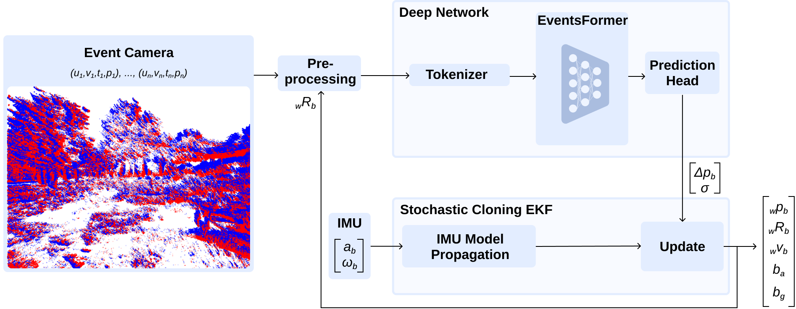
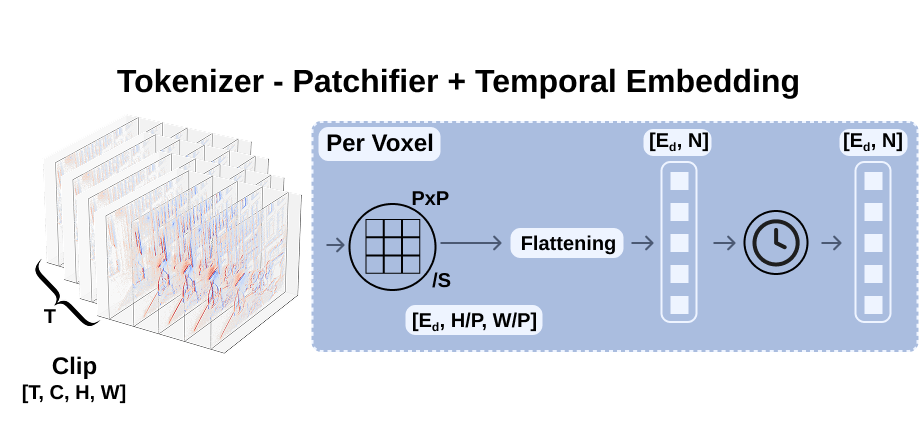
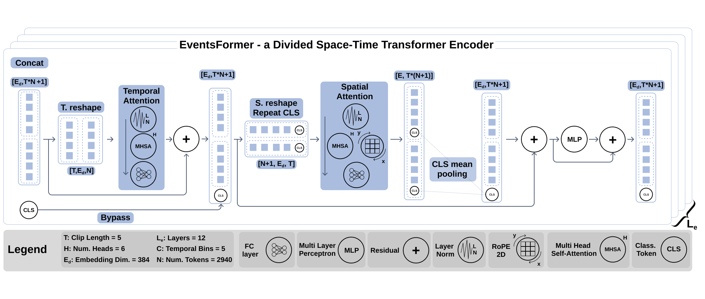

# TLEIO: Tight Learned Event-Inertial Odometry

TLEIO is a tight learned event-inertial odometry pipeline. The repository contains the data download and preprocessing scripts, the EventsFormer network used to regress relative event-camera motion, and a stochastic-cloning EKF that fuses those learned constraints with IMU measurements.

## Demo Video

TLEIO demo showing the event-inertial odometry pipeline and its trajectory output.

https://github.com/user-attachments/assets/04fa2e40-7d03-445a-8c5b-53c3609a9f07


## Method Overview


The full pipeline converts event streams into voxel clips, predicts short-window relative displacements with EventsFormer, and fuses those measurements with high-rate IMU propagation in the filter.



EventsFormer is the learned front-end. It receives preprocessed event voxels and outputs relative translation constraints, optionally with uncertainty, that are consumed by the filter back-end.



The tokenizer splits each event voxel into patches and projects them into tokens for the transformer.



The EventsFormer encoder applies divided space-time attention over the voxel clip before the prediction head regresses consecutive relative motions.

## Repository Layout

```text
cfg/                  YAML defaults for the command-line scripts
scripts/download/     Dataset download helpers
scripts/processing/   Ground-truth processing and voxel precomputation
scripts/testing/      EventsFormer inference scripts
scripts/viz/          Optional visualization utilities
src/learning/         Dataloaders and EventsFormer implementation
src/filter/           Filter implementation
src/main_network.py   Training entry point
src/main_filter.py    Filter entry point
```

Generated data, checkpoints, logs, plots, and filter outputs are intentionally ignored by git.

## Setup

```bash
conda env create -f environment.yaml
conda activate tleio
git submodule update --init --recursive
```

Most scripts read defaults from `cfg/*.yaml`; command-line arguments override the YAML values.

## Download Data

### EDS

```bash
python scripts/download/download_eds.py --seq 0,1,2,3,4,5
```

This downloads EDS data under `data/eds`. The default sequence list is in `cfg/download_eds.yaml`.

### TartanAir + TartanEvent

```bash
python scripts/download/download_tartanair.py --env office --difficulty easy hard
```

Training data is downloaded under `data/tartanair`. The script combines TartanAir pose data with TartanEvent event streams.

### TartanAir + TartanEvent Competition Split

```bash
python scripts/download/download_tartanair_competition.py
```

Competition data is written under `data/tartanair/competition`.

## Process Data

Process EDS into train, validation, and test folders:

```bash
python scripts/processing/processing_eds.py --overwrite
```

Process TartanAir/TartanEvent:

```bash
python scripts/processing/processing_tartan.py --overwrite
```

Processed sequence folders contain the files used by the rest of the pipeline:

```text
events.h5
anchor_poses.txt
relative_motions.txt
stamped_groundtruth.txt
imu.csv
```

## Precompute Event Voxels

EventsFormer inference and training use precomputed voxel clips by default.

```bash
python scripts/processing/precompute_derotated_voxels.py \
  --root_dir data/eds/processed_testing \
  --output_dir data/eds/precomputed_testing \
  --denoising true \
  --overwrite
```

Each precomputed sequence contains `derotated_voxels.npy`, `relative_motions.txt`, and `metadata.json`.

## Train EventsFormer

Training is optional if you already have a trained checkpoint. Update `cfg/train.yaml` or override paths from the CLI:

```bash
python src/main_network.py \
  --root_dir data/eds/precomputed_train \
  --val_root_dir data/eds/precomputed_validation \
  --checkpoint_path checkpoints/eds_eventsformer
```

Checkpoints and the matching `args.txt` are saved in the selected checkpoint directory.

## Run EventsFormer Inference

Run inference on one precomputed sequence and write the predicted relative motions into the matching processed sequence folder. This is the format expected by the filter.

```bash
SEQ=03_rocket_earth_dark
CKPT=checkpoints/eds_eventsformer/checkpoint_best.pth

python scripts/testing/test.py \
  --sequence_dir data/eds/precomputed_testing/$SEQ \
  --checkpoint_file $CKPT \
  --output_file data/eds/processed_testing/$SEQ/$SEQ.txt \
  --average_overlaps
```

The prediction file has columns:

```text
t0_us t1_us px py pz
```

If `--save_covariance` is used with a covariance checkpoint, the file also contains `sigma_x sigma_y sigma_z`.

To run inference on every sequence in a precomputed folder:

```bash
python scripts/testing/batch_test.py \
  --batch_root data/eds/precomputed_testing \
  --checkpoint_file checkpoints/eds_eventsformer/checkpoint_best.pth \
  --output_dir data/eds/predicted_relative_motions \
  --average_overlaps
```

## Run the Filter

Run the EKF on one processed sequence after writing the EventsFormer prediction file into that same sequence folder.

```bash
python src/main_filter.py \
  --dataset eds \
  --processed_root data/eds/processed_testing \
  --sequence 03_rocket_earth_dark \
  --plot_transformer \
  --plot_projections
```

Filter outputs are saved under:

```text
outputs/main_filter/<dataset>/<sequence>/
```

The main files are `stamped_traj_estimate.txt` and the trajectory/error plots generated by `scripts/filter_diagnostics.py`.

## Inspect Network Trajectories

To reconstruct and plot a trajectory directly from relative-motion predictions:

```bash
python scripts/plot_trajectories.py \
  --gt data/eds/processed_testing/03_rocket_earth_dark/stamped_groundtruth.txt \
  --rel data/eds/processed_testing/03_rocket_earth_dark/03_rocket_earth_dark.txt \
  --gt_rel data/eds/processed_testing/03_rocket_earth_dark/relative_motions.txt \
  --save_dir plots/eds_03_rocket_earth_dark
```

## Reproduce the Main Pipeline Results

1. Create the environment and initialize submodules.
2. Download the target dataset split.
3. Run the matching processing script.
4. Precompute event voxels for the processed split.
5. Run EventsFormer inference with the trained checkpoint.
6. Run `src/main_filter.py` on each processed sequence.
7. Use the saved files in `outputs/main_filter/<dataset>/<sequence>/` for trajectory plots and metrics.

For an EDS test sequence, the complete command sequence is:

```bash
SEQ=03_rocket_earth_dark
CKPT=checkpoints/eds_eventsformer/checkpoint_best.pth

python scripts/processing/precompute_derotated_voxels.py \
  --root_dir data/eds/processed_testing \
  --output_dir data/eds/precomputed_testing \
  --denoising true \
  --overwrite

python scripts/testing/test.py \
  --sequence_dir data/eds/precomputed_testing/$SEQ \
  --checkpoint_file $CKPT \
  --output_file data/eds/processed_testing/$SEQ/$SEQ.txt \
  --average_overlaps

python src/main_filter.py \
  --dataset eds \
  --processed_root data/eds/processed_testing \
  --sequence $SEQ \
  --plot_transformer \
  --plot_projections
```

## Notes

The public repository does not include downloaded datasets or trained checkpoint binaries. Place released checkpoints under `checkpoints/` and keep their `args.txt` files next to the `.pth` files, because inference loads the training-time model configuration from that file.
